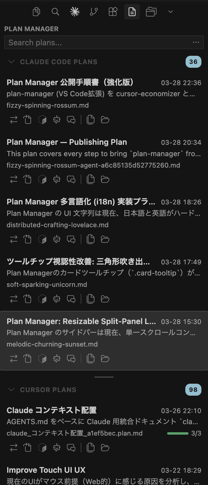
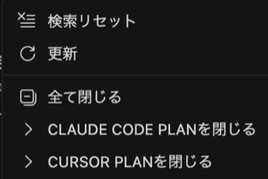

# Plan Manager

> Cursor / Claude Code のプランファイルを一覧表示・検索・変換する VS Code 拡張機能
>
> VS Code extension to browse, search, and convert plan files across Cursor and Claude Code

---

## 📖 背景 / Background

AI コーディングアシスタント（Cursor, Claude Code）はプランファイルを生成しますが、マシン各所に散在します。 
AI coding assistants (Cursor, Claude Code) generate plan files, but they are scattered across your machine.

- `~/.claude/plans/` — Claude Code プラン（ランダムファイル名、メタデータなし） 
  Claude Code plans (random filenames, no metadata)
- `~/.cursor/plans/` — Cursor プラン（YAML フロントマター付き） 
  Cursor plans (with YAML frontmatter)
- `{project}/.cursor/plans/` — Cursor ワークスペースプラン（Save to workspace） 
  Cursor workspace plans (Save to workspace)

メタデータを含むプランの受け渡しに時間がかかり、メタデータなしで共有すると品質が低下します。**Plan Manager** はプランの一覧表示、検索、変換を一元化してこの課題を解消します。 
Sharing plans with metadata is time-consuming, and sharing without metadata reduces quality. **Plan Manager** centralizes browsing, searching, and conversion of plans to solve this problem.

---

## 🚀 使い始める / Getting Started

アクティビティバーに Plan Manager アイコンが表示されます。クリックでプラン一覧を開き、browse できます。 
The Plan Manager icon appears in the Activity Bar. Click to open and browse the plan list.

---

## ✨ 機能 / Features

- 📋 **プラン一覧** — Claude Code / Cursor プランをツリービューで一覧表示・browse（ファイル名・プラン名・日時・ステータス） **Plan List** — Browse and list Claude Code / Cursor plans in TreeView (filename, plan name, date, status)
- 🔍 **プラン検索** — キーワードでプランをすばやく search・フィルタ **Plan Search** — Quickly search and filter plans by keyword
- 🔗 **Cursor プランとして開く** — ワンクリックで Cursor Agent 用プロンプト+パスをクリップボードにコピー（deep link 形式） **Open as Cursor Plan** — One-click copy of Cursor Agent prompt + path to clipboard (deep link style)
- 🤖 **Claude プランとして開く** — ワンクリックで `claude --permission-mode plan` をターミナルに送信（deep link 実行） **Open as Claude Plan** — One-click terminal launch of `claude --permission-mode plan` (deep link execution)
- 📎 **パスコピー** — フルパスをクリップボードにコピー **Copy Path** — Copy full path to clipboard
- 🕐 **生成時刻表示** — 作成日時・更新日時をツールチップで確認 **Timestamp Display** — Check creation and modification time in tooltip
- 🔄 **Cursor プランに変換** — Claude Code → Cursor 形式（YAML フロントマター付き）にワンクリック conversion **Convert to Cursor Plan** — One-click conversion from Claude Code to Cursor format (with YAML frontmatter)
- 🔄 **Claude プランに変換** — Cursor → Claude Code 形式にワンクリック conversion **Convert to Claude Plan** — One-click conversion from Cursor to Claude Code format
- 📊 **ステータス管理** — draft / active / done を非破壊で管理（プランファイル自体は変更しない） **Status Management** — Non-destructive draft / active / done management (plan files remain unchanged)
- 🎨 **カラフルアイコン** — プラン名キーワードから種別推定し自動割当 **Colorful Icons** — Auto-assigned by keyword-based plan type detection
- ↕️ **ソート** — 名前順 / 日付順 / サイズ順で browse **Sort** — Browse by name, date, or size
- 📂 **Finder で表示** — OS ファイルマネージャーで直接開く **Reveal in Finder** — Open directly in OS file manager
- ♻️ **自動更新** — ファイルシステム監視でリアルタイム更新 **Auto Refresh** — Real-time update via filesystem watching
- 🌐 **i18n** — 日本語 / English（VS Code のロケール設定に自動追従。メニューラベル・ボタンツールチップが対象） **i18n** — Japanese / English (auto-follows VS Code locale for menu labels and button tooltips)

---

## 🌳 ツリービュー / Tree View

プランを browse・search できるツリービューです。 
A tree view to browse and search your plans.

| 情報 | Description | 説明 | Details |
|------|-------------|------|---------|
| フルパス | Full Path | ファイルの絶対パス | Absolute file path |
| プラン名 | Plan Name | フロントマター `name` または H1 見出し | Frontmatter `name` or H1 heading |
| サイズ | Size | ファイルサイズ | File size |
| 作成日時 / 更新日時 | Created / Modified | ファイルタイムスタンプ | File timestamp |
| タスク進捗 | Task Progress | Cursor プランの todo 完了率（プログレスバー） | Cursor plan todo completion (progress bar) |
| ステータス | Status | draft / active / done | draft / active / done |

---

## 🎛️ コマンドパレット / Command Palette

各プランカード下部のアイコンから操作できます。左から順に: 
Each plan card has action icons at the bottom. From left to right:

- ✅ **変換** — Claude ↔ Cursor 相互 convert **Convert** — Bi-directional Claude ↔ Cursor conversion
- ✅ **エディタで開く** — Markdown をエディタで表示 **Open in Editor** — View Markdown in editor
- ✅ **Cursor で開く** — Cursor 用 deep link プロンプトをコピー **Open in Cursor** — Copy deep link prompt for Cursor
- ✅ **Claude で開く** — Claude Code plan mode で起動 **Open in Claude** — Launch Claude Code in plan mode
- ｜ *セパレータ*
- ✅ **パスコピー** — フルパスをクリップボードにコピー **Copy Path** — Copy full path to clipboard
- ✅ **Finder で表示** — OS ファイルマネージャーで開く **Reveal in Finder** — Open in OS file manager

---

## 🔗 プランを開く / Open Plans

プランの開き方は4種類あります。用途に応じて使い分けてください。 
There are 4 ways to open a plan. Choose based on your use case.

### 1. エディタで開く / Open in Editor

プランカードをクリック、または右クリック → 「エディタで開く」で Markdown をエディタで表示します。 
Click a plan card, or right-click → "Open in Editor" to view the Markdown in the editor.

### 2. Cursor で開く / Open in Cursor (Deep Link)

右クリック → 「Cursor で開く」で Deep Link URI (`cursor://`) を通じて Cursor に直接プロンプトを送信します。ワンクリックでプランが開きます。バックアップとしてクリップボードにもコピーされます。 
Right-click → "Open in Cursor" sends the prompt directly to Cursor via Deep Link URI (`cursor://`). One click opens the plan. The prompt is also copied to clipboard as a backup.

### 3. Claude で開く / Open in Claude

右クリック → 「Claude で開く」でワンクリック起動します。Claude Code 拡張がインストール済みなら直接 plan mode で開きます。未インストールの場合はターミナルで CLI を起動します。 
Right-click → "Open in Claude" launches with one click. If the Claude Code extension is installed, it opens directly in plan mode. Otherwise, it launches the CLI in a terminal.

### 4. Finder で表示 / Reveal in Finder

右クリック → 「Finder で表示」で OS のファイルマネージャーでプランファイルの場所を開きます。 
Right-click → "Reveal in Finder" opens the plan file location in your OS file manager.

> **技術的背景**: Cursor は `.plan.md` とは別に内部レジストリでメタデータを管理しており、ファイル単体では plan mode UI を復元できません。Claude Code の `/plan open` は現在セッションのプランのみ対応です。そのため deep link 方式でプロンプトを経由してプランを開きます。 
> **Technical note**: Cursor manages metadata in a separate internal registry from `.plan.md` files, so the plan mode UI cannot be restored from the file alone. Claude Code's `/plan open` only supports plans in the current session. This is why we use a deep link approach via prompts to open plans.

---

## 🔄 変換機能 / Conversion

Claude Code プランと Cursor プランをワンクリックで相互変換（conversion）できます。 
Convert between Claude Code plans and Cursor plans with one click.

### Claude Code → Cursor 変換 / Conversion

| 変換元 / Source | 変換先 / Target |
|-----------------|-----------------|
| H1 見出し / H1 heading | `name` |
| Context / Overview セクション / section | `overview` |
| チェックボックス `- [x]` / `- [ ]` / Checkboxes | `todos[]` (completed/pending) |
| H2/H3 フェーズ見出し（フォールバック） / Phase headings (fallback) | `todos[]` |

### Cursor → Claude Code 変換 / Conversion

| 変換元 / Source | 変換先 / Target |
|-----------------|-----------------|
| YAML `name` | H1 見出し / H1 heading |
| `overview` | `## Overview` セクション / section |
| `todos[]` | チェックボックスリスト / Checkbox list |

変換はワンクリックで完了し、元ファイルは変更されません。convert されたプランは新しいファイルとして保存されます。 
Conversion completes in one click without modifying the original file. The converted plan is saved as a new file.

---

## ⌨️ コマンド / Commands

| Command | 説明 | Description | トリガー / Trigger |
|---------|------|-------------|-------------------|
| `Plan Manager: Refresh Plans` | プラン一覧を再スキャン | Re-scan plan list | パレット, ツリータイトル / Palette, tree title |
| `Plan Manager: Search Plans` | キーワードで search | Search plans by keyword | パレット / Palette |
| `Plan Manager: Open in Editor` | MD をエディタで開く | Open MD in editor | カードクリック / Card click |
| `Plan Manager: Open in Cursor` | Cursor に deep link 送信 | Send deep link to Cursor | カードアイコン / Card icon |
| `Plan Manager: Open in Claude` | Claude plan mode で開く | Open in Claude plan mode | カードアイコン / Card icon |
| `Plan Manager: Copy Path` | フルパスをコピー | Copy full path | カードアイコン / Card icon |
| `Plan Manager: Convert to Cursor Plan` | Claude → Cursor 変換 | Convert Claude → Cursor | カードアイコン / Card icon |
| `Plan Manager: Convert to Claude Plan` | Cursor → Claude 変換 | Convert Cursor → Claude | カードアイコン / Card icon |
| `Plan Manager: Reveal in File Explorer` | Finder で表示 | Reveal in Finder | カードアイコン / Card icon |

---

## ⚙️ 設定 / Configuration

| Setting | 説明 | Description | Default |
|---------|------|-------------|---------|
| `planManager.claudePlansPath` | Claude プランスキャンパス | Claude plan scan path | `~/.claude/plans` |
| `planManager.cursorPlansPath` | Cursor プランスキャンパス | Cursor plan scan path | `~/.cursor/plans` |
| `planManager.additionalScanPaths` | 追加スキャンパス | Additional scan paths | `[]` |
| `planManager.autoRefreshEnabled` | 自動更新 | Auto refresh | `true` |
| `planManager.autoRefreshIntervalSeconds` | 更新間隔（秒） | Refresh interval (sec) | `30` |
| `planManager.sortBy` | ソート基準 | Sort order | `"date"` |

---

## 🔧 トラブルシューティング / Troubleshooting

| 症状 | Symptom | 対処 | Solution |
|------|---------|------|----------|
| プラン未表示 | Plans not shown | スキャンパス設定を確認 | Check scan path settings |
| Claude プラン未検出 | Claude plans not found | `~/.claude/plans/` の存在確認 | Verify `~/.claude/plans/` exists |
| Cursor プラン未検出 | Cursor plans not found | `~/.cursor/plans/` の存在確認 | Verify `~/.cursor/plans/` exists |
| 変換結果が不正 | Conversion result incorrect | 元ファイルの形式確認（H1 / フロントマター） | Check source format (H1 / frontmatter) |
| search 結果が空 | Search returns empty | キーワード・スキャンパスを確認 | Check keyword and scan paths |

---

## Contributing

コントリビューション歓迎。 
Contributions welcome.

1. Fork → `git checkout -b feature/amazing-feature` → PR

## License

MIT

## 🔒 プライバシー / Privacy

プランファイルのパスとメタデータのみを読み取ります。ファイル内容の外部送信はありません。 
Only file paths and metadata are read. No file contents are transmitted externally.

## 🔗 関連プロジェクト / Related Projects

- [Cursor Economizer](https://github.com/cursor-tool/cursor-economizer) — Cursor 利用料金の可視化 
  Cursor usage cost visualization

## 🗺️ Roadmap

- **プラン検索強化** — 全文 search、フィルタ条件保存 
  **Enhanced Plan Search** — Full-text search with saved filter conditions
- **プロジェクト別グループ** — ワークスペースプランの browse・整理 
  **Project Grouping** — Browse and organize workspace plans
- **Mermaid 描画** — ダイアグラムレンダリング 
  **Mermaid Rendering** — Diagram rendering
- **変換プレビュー** — convert 前の差分表示 
  **Conversion Preview** — Diff display before conversion
- **deep link 拡張** — エディタ間の直接プラン連携 
  **Deep Link Enhancement** — Direct plan linking across editors

[Issue](https://github.com/cursor-tool/plan-manager/issues) でフィードバック受付中。
Feedback welcome via Issues.

## ☕ Support This Project

- [GitHub Sponsors](https://github.com/sponsors/cursor-tool)

寄付は任意です。 
Donations are optional.
